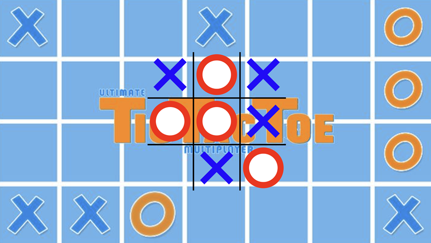

# Tic Tac Toe

## Overview
Tic-tac-toe is played on a three-by-three grid by two players, who alternately place the marks X and O in one of the nine spaces in the grid

## User Interface

### Play Area
- Cell color: `#000000`
- O color: `#FF0000`
- X color: `#0000FF`

### Result Area
- Background color:`#99FF33`
- Text color:`#FFFFFF`
- Play again button:`#FFFFFF` with text `#000000`

## Colours

| HEX Code  | Display                                                                 | Description       |
|-----------|-------------------------------------------------------------------------|-------------------|
| `#000000` |              | Cell & Text of Button    |
| `#FF0000` |              | O |
| `#0000FF` |              | X |
| `#99FF33` |              | Result Background |
| `#FFFFFF` |              | Text for result & Text of button |

## Gameplay Instructions

1. Tic-tac-toe is played on a three-by-three grid by two players, the first player reprensents X, and the second player represents O.
2. The player who succeeds in placing three of their marks in a horizontal, vertical, or diagonal row is the winner.

